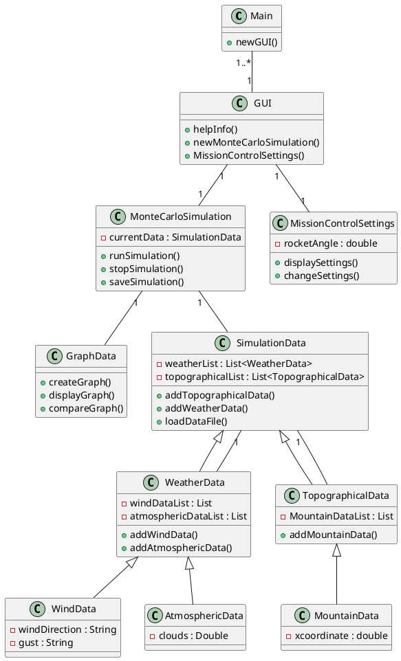
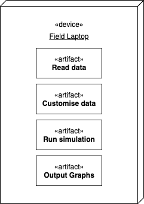
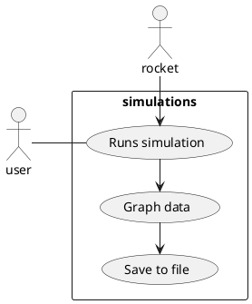
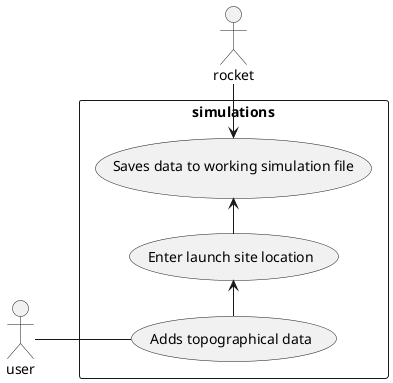
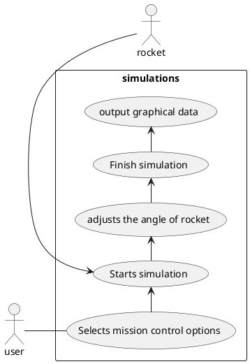

# ENGR 301: Architectural Design and Proof-of-Concept

## Proof-of-Concept

The aim of an architectural proof-of-concept (spike or walking skeleton) is to demonstrate the technical feasibility of your chosen architecture, to mitigate technical and project risks, and to plan and validate your technical and team processes (e.g., build systems, story breakdown, Kanban boards, acceptance testing, deployment).

A walking skeleton is an initial technical attempt that will form the architectural foundation of your product. Since a walking skeleton is expected to be carried into your product, it must be completed to the quality standards expected for your final product. A walking skeleton should demonstrate all the technologies your program will rely on "end-to-end" &mdash; from the user interface down to the hardware.

In the context of ENGR 301, a walking skeleton does not need to deliver any business value to your project: the aim is technical validation and risk mitigation.

## Document

The aim of the architectural design document is to describe the architecture and high-level design of the system your group is to build, to identify any critical technical issues with your design, and to explain how you have addressed the highest rated technical and architectural risks. The architecture document should also demonstrate your understanding of architectural techniques and architectural quality, using tools and associated notations as necessary to communicate the architecture precisely, unambiguously and clearly in a written technical document.

Page specifications below are *limits not targets* and refer to the pages in the PDF generated from the markdown. Because the size of your document is necessarily limited, you should ensure that you focus your efforts on those architectural concerns that are most important to completing a successful system: if sections are at their page limit, indicate how many items would be expected in a complete specification.

The ENGR 301 project architecture design document should be based on the standard ISO/IEC/IEEE 42010:2011(E) _Systems and software engineering &mdash; Architecture description_, plus appropriate sections from ISO/IEC/IEEE 29148:2018(E) _Systems and software engineering &mdash; Life cycle processes &mdash; Requirements engineering_; ISO/IEC/IEEE 15289:2017 _Systems and software engineering &mdash; Content of life-cycle information items (documentation)_; ISO/IEC/IEEE 15288:2015 _Systems and software engineering &mdash; System life-cycle processes_; ISO/IEC/IEEE 12207:2017 _Systems and software engineering &mdash; Software life cycle processes_ and ISO 25010 SQuaRE; with notations from ISO/ISE 19501 (UML). In particular, Annex F of ISO/IEC/IEEE 15288 and Annex F of ISO/IEC/IEEE 12207. These standards are available through the Victoria University Library subscription to the [IEEE Xplore Digital Library](https://ieeexplore.ieee.org/) (e.g., by visiting IEEE Xplore from a computer connected to the University network).

The document should contain the sections listed below, and conform to the formatting rules listed at the end of this brief.

All team members are expected to contribute equally to the document and list their contributions in the last section of the document (please make sure that your continued contribution to this document can be traced in GitLab). You should work on your document in your team's GitLab repository in a directory called "M2_Architecture". If more than one team member has contributed to a particular commit, all those team member IDs should be included in the first line of the git commit message. ``git blame``, ``git diff``, file histories, etc. will be tools used to assess individual contributions, so everyone is encouraged to contribute individually (your contribution should be made to many sections of the document, rather than focusing on just a single section), commit early and commit often.

---

# ENGR 301 Project *NN* Architectural Design and Proof-of-Concept

**Authors:** Justina Koh, Jacqui Dong, Georgia Strongman 

## 1. Introduction

Throughout the World, rockets are used for a plethora of reasons: to launch satellites, human spaceflight and space exploration to name a few. The process of building and launching rockets is incredibly expensive, and so it is paramount to factor in all possible conditions and outcomes that could occur when launching a rocket.
The project designed by the Course Coordinator is triadic: the first part involves the actual building of the rocket, the second part involves the programming of the rocket, and the third part involves the use of external software to test the predictability and likelihood of success of the rocket. While these subprojects are primarily designed to be carried out individually, ultimately, communication is to occur between the three groups to create a wholly, and successfully functioning rocket.
Our group project predominantly focuses on the use of Monte Carlo simulations to help design the rocket. These simulations are used to model the probability of different outcomes based on a range of variables that could affect the rocket launch such as the wind-speed, wind-direction and weather conditions.

### Client
| | |
|---|---|
| Client | Andre Geldenhuis |
| Email | andre.geldenhuis@vuw.ac.nz |
| Mattermost tag | @geldenan |

Andre Geldenhuis is a staff member at Victoria University of Wellington. He enjoys loves rockets and is part of the New Zealand Rocketry Association. 

### 1.1 Purpose

The purpose of the system is to create use _Monte Carlo_ simulations to most accurately predict the trajectory of the rocket and consequently, where the rocket will land.

### 1.2 Scope

A plugin for OpenRocket that utilises pre-existing frameworks to run simulations according to the Monte Carlo method. The simulation will take into account basic weather data (for example wind and atmospheric conditions) and be contextualised within the launch site's topography. Integration with controller software will be provided, allowing controlled motor gimballing to be included in the simulation. Flight performance and path data will be presented in a graphical format, with a focus on the rocket's predicted landing site.

### 1.3 Changes to requirements

If the requirement have changed significantly since the requirements document, outline the changes here. Changes must be justified and supported by evidences, i.e., they must be substantiated. (max one page, only if required)

## 2. References

References to other documents or standards. Follow the IEEE Citation Reference scheme, available from the [IEEE website](https://ieee-dataport.org/sites/default/files/analysis/27/IEEE%20Citation%20Guidelines.pdf) (PDF; 20 KB). (1 page, longer if required)

## 3. Architecture

Describe your system's architecture according to ISO/IEC/IEEE 42010:2011(E), ISO/IEC/IEEE 12207, ISO/IEC/IEEE 15289 and ISO/IEC/IEEE 15288.

Note in particular the note to clause 5 of 42010:

_"The verb include when used in Clause 5 indicates that either the information is present in the architecture description or reference to that information is provided therein."_

This means that you should refer to information (e.g. risks, requirements, models) in this or other documents rather than repeat information.

### 3.1 Stakeholders

*See ISO/IEC/IEEE 42010 clause 5.3 and ISO/IEC/IEEE 12207 clause 6.4.4.3(2).*

*For most systems this will be about 2 pages, including a table mapping concerns to stakeholder.*

| Stakeholder | Concern |
|---------|-------------|
| The users of the system. This includes those who will be testing the PIDs with the software and those testing mission control software. This includes groups 1 to 12 taking part in the course. | The users will be concerned with the functionality of the system, its purpose and its suitability for the purpose. |
| The team developing the system. This includes Michael Behan, Jacqueline Dong, Justina Koh, Max McMurray, Alexander Pace and Georgia Strongman. | The developers will be concerned with the feasibility, suitability, maintainability of the project. |
| The customer requesting the system to be made. This will be Andre Geldenhuis | The customer is be concerned with the purpose, suitability, evolvability of the system.  |
| The university coordinators in charge of the project. These include Aaron Chen and Craig Anslow. | The managers are concerned with the feasibility, suitability, evolvability of the system. |

### 3.2 Architectural Viewpoints
(1 page, 42010 5.4) 

Identify the architectural viewpoints you will use to present your system's architecture. Write one sentence to outline each viewpoint. Show which viewpoint frames which architectural concern.

#### Logical
The logical viewpoint corresponds to the functionality of the system it provides to end-users; the system is divided into a set of key abstractions and are expressed through UML state and class diagrams.

#### Development
The development viewpoint describes the architecture for the software management processes involved in the system, expressed through UML component diagrams.

#### Process
The process viewpoint captures the non-functional requirements of the system, including behaviour, concurrency, performance and availability, and how the main abstractions from the logical view fit within the process architecture.

#### Physical
The physical viewpoint represents the infrastructure of an application, which describes the mapping of software to hardware.

#### Scenarios
The scenario viewpoint captures a small set of use-cases describing the interaction between users or processes, which illustrate and validate the architecture and form the initial starting-point for architectural prototype tests.

#### Circuit Architecture
The circuit architecture viewpoint defines how the physical system is put together and outlines any problems which may interfere with the physical system.

#### Hardware Architecture
The hardware architecture viewpoint outlines purposes for which the software and systems interact with the hardware, primarily focusing on how the hardware enables the overall system to function.

### 4. Architectural Views

Describe your system's architecture in a series of architectural views, each view corresponding to one viewpoint.

You should include views from the following viewpoints (from Kruchten's 4+1 model):

 * Logical
 * Development
 * Process
 * Physical 
 * Scenarios - present scenarios illustrating how two of your most important use cases are supported by your architecture

As appropriate you should include the following viewpoints:

 * Circuit Architecture
 * Hardware Architecture

Each architectural view should include at least one architectural model. If architectural models are shared across views, refer back to the first occurrence of that model in your document, rather than including a separate section for the architectural models.

### 4.1 Logical
In this system, from a logical viewpoint, the user should be able to run simulations of the rocket in OpenRocket, which predict the trajectory of the rocket and where the rocket will land. There are four states the Simulation Software can be in; Idle, Load, Simulation and Output. The diagram which represents the logical view is the UML class diagram. The UML diagram in the [Project Requirements]() document, section 3.5 shows the relationship between the modules, functions and classes. 

##### The main classes in this UML State diagram are:
 
MonteCarloSimulation - This class allows the Monte Carlo Simulations to be run.
 
SimulationData- This class contains all of the data for the Monte Carlo Simulation. Users are able to customize the simulation data to reflect the different environmental conditions such as Weather Data, Topographical Data, or Atmospheric Data.
 
MissionControlSettings - This class holds the information for the Mission Control Settings which can alter the performance and overall flight of the rocket.
 
Graph Data - One of the main purposes of this system is to output the predicted landing spots of the rocket to a graphical output. This class converts the data from the simulation into a user-readable graph.

### 4.2 Development
This section focusses on the development aspect of the project. It follows the Krutchen's 4 + 1 architectural view model. 

The development section covers the software management aspects of the project. This includes the following subsections:
* 4.2.1 Roles and responsibilities
* 4.2.2 Project Management Development Technique
* 4.2.3 Project Development Standards
* 4.2.4 Work Logs
* 4.2.5 Project Development Testing
* 4.2.6 Project Development Monitoring

This section must be taken into consideration when developing and project as a range of problems can arise due to uneven allocation of work between the team members, not having tasks planned (efficiently), or insufficient progress monitoring for the project.

#### 4.2.1 Roles and Responsibilities:

This section has been added to show who is involved in the project and what role they take. 

| Name | Role |
| ------ | ------ |
| Andre Geldenhuis | Client |
| Craig Anslow | Course coordinator |
| Benjamin Secker | Senior Manager |
| ------ | ------ |
| Alex Pace | Software Developer |
| Georgie Strongman | Software Developer |
| Jacqui Dong | Software Developer |
| Justina Koh | Software Developer |
| Max McMurray | Software Developer |
| Michael Behan | Software Developer |

As this is a team project, we decided that is was most appropriate for everyone to receive the role of a software developer. This means that everyone within the group has the same role, and therefore no one it taking charge of the project as a whole. Instead, we will have a rotation that will allow each team member to be a scrum master and minute taker for at least one sprint.

#### 4.2.2 Project Management Development technique 

We will be using the _Agile method_ in order to develop our product. In particular, we will be using the Scrum methodology of Agile and will assign a new Scrum master to each new sprint. Our sprints will be two weeks long, and we will also conduct a bi-weekly retrospective discussing what went wrong/right in the previous sprint, and a weekly meeting with our senior manager. 

At each meeting, we will also be taking minutes. This will be recorded in the 'timetable for minutes, scrum master and project' and the minute taker will be rotated between the group members’ in-coordination with our sprints.

In order to focus our intentions and be very clear about our main goal for the week, we will be recording this on a wiki page as well. This page also contains a timetable which details who is the scrum master and minute-taker the week. 

* [Timetable for minutes, scrum master and project](Project/Minute-and-Scrum-Master-Timetable)

#### 4.2.3 Project Development Standards

In order to ensure that all work being produced is of good quality and free from errors, we will be doing the following:
1. We will branch before editing code or documents.
2. We will submit a merge request which must be approved by a minimum of one other person in the team who did not work on that branch. 
3. When writing documentation and other text-based content for the project, we will use the markdown format to do so.

When adding a _commit message_ it should follow the design as listed below:
* A short header no longer than a sentence, briefly stating what was done in the commit
* A body which contains a more detailed account of what was changed in the commit
* Tag(s) listing all other team members who worked on the commit 

When adding a _merge request_ it should follow the design as listed below:
* The merge request should follow the template(s) provided in the <!--Add link in once the branch has been merged-->
* All code that put in a merge request should be free from errors and pass all pipelines

When _approving_ a _merge request_ the following must be listed below:
* Before pushing to the main branch, a merge request must be made and reviewed by a minimum of one other person.
* The reviewer must review the code thoroughly, and check for all possible mistakes, including, but not limited to: syntax errors, spelling mistakes, bad formatting.
* If the reviewer identifies some mistakes, a comment must be made acknowledging this and the merge request will not be approved until all issues are resolved. 

#### 4.2.4 Work logs
In order to ensure that all team members are contributing an equal amount to the project, we will be logging whether each member is at each assigned lab slot. This will be recorded on the [Lab Time Log](https://gitlab.ecs.vuw.ac.nz/course-work/engr300/2020/group15/group-15/-/wikis/Lab-time-log).

Each member can also use the [Lab Time Log Website](https://course-work.glp.ecs.vuw.ac.nz/engr300/2020/group15/group-15/LabLogSite.html) which will automatically generate the times that people enter and leave the labs. 

For each sprint, a new board will be created and this will be filled with issues that we believe will be relevant for the sprint. Each team member is assigned 2-3 tickets per sprint. 

For each issue created in the sprint, we will add the level of difficulty we estimate it to be. This should provide us with some assistance as to how long each issue should take, and how many issues we will be able to finish in the sprint. We will also use the burn-down chart to ensure that each team member is being assigned and completing an even amount of work.

Additionally, we will assign tickets to Epics and will be using Epics to help monitor the progress that our team is making.  

#### 4.2.5 Project Development Testing
All documentation produced for this project will not need to be tested. The documentation will go under rigorous inspection while being written as well as during merge requests. 

All code will need to have tests written for it. We should achieve high coverage with these unit tests - a minimum of at least 90% coverage. To ensure that the code is of good quality, we will have different members of the team review it. 

All merge requests for code will be tested. We will be using CI / CD pipelines to do so. The pipelines will ensure that the code is free from errors, does not contain build failures, and that all unit tests written will pass. 

We will also test our code on different operating systems once a week to ensure that our code is not just compatible with just one laptop / OS. 

### 4.3 Process
The process viewpoint identifies the individual processes that are interacting to complete the scenarios. The process architecture can control the deployment, starting, recovery, reconfiguration, and shutdown of a system. The purpose of the process view is to capture the concurrency and reliability of the system, through the sequence and timing of certain communications.
 
The concurrency present in the system can be associated with reading data used for running the Monte Carlo Simulation. The data read will be sourced from the simulation data file as well as the PID controller variables. 

### 4.4 Physical 
For our project, the topology consists of only one physical component. This component is a:
* Field Laptop
 
The field laptop will contain software which we will use in order to run our simulations. The software on the field laptop will read the data, customize data, run the simulations, and create a graphical output. 

### 4.5 Scenarios

*Running the simulations and saving the data*
One of the main purposes of our simulations is to be able to graphically view the predicted landings of the rocket simulations. Once the simulations are finished, the user can save the graph data.

*Adding topographical data*
The user is able to add topographical or weather data to the working simulation file to change the environmental conditions during the rocket simulations. This allows the graphical output created to be more accurate depending on the launch and journey of the rocket.

Another main purpose of our simulation is to be able to run the simulations with mission control software. This means the user is able to adjust rocket settings to change the simulation graphical data output.

## 5. Development Schedule

### 5.1 Schedule

Key project deliverables: 

| Deliverable: | Date: |
|------|-------|
| Architectural Prototype | T2 Weeks 3-4 (Sprint 5) |
| Minimum Viable Product | T2 Week 7-8 (Sprint 7) |
| Final Release | T2 Week 11-12 (Sprint 9 - final sprint) |

### 5.2 Budget and Procurement

#### 5.2.1 Budget
The budget for this project is: __$0.00__

A table has been made below to show the equipment, software and technology required and the corresponding costs:

| Particular needed | Cost |
| ------ | ------ |
| Laptop for software development | $0.00 |
| OpenRocket Software | $0.00 | 
| IDEs for software development | $0.00 | 
| GitLab for version-control | $0.00 | 

This is due to the following reasons:
* All the developers are unpaid
* OpenRocket is an open-source software
* Open-source IDEs will be used by the developers
* All additionally development tools used for the project are provided at no cost by the university

#### 5.2.2 Procurement

| Good or Service | Procurement |
|-----------------|-------------|
| Repository | The university has provided the team with a Gitlab repository that can be used throughout development. The Gitlab site has tools that allow for management of sprints and issues that will be used. |
| OpenRocket Code | The openRocket code is required to deliver the project goals due to the goal being orientated around the software. OpenRocket is open-source meaning it can be procured from the repository and used freely. The code can easily be put in a folder in the project's repository for easy access. |

### 5.3 Risks 

| Risk | Likelihood | Impact | Mitigation |
|------|-------|-------|-----|
| Sickness or other incapacitation of a team member reducing their productivity and leading to deadlines not being met | High | Tolerable | As we are already at home in quarantine, we are already used to working remotely, and do not need to worry about spreading any sickness. In the case that a team member is too sick to work, we should be able to rearrange duties to cover the workload as it is a team of 6 developers, and it is likely that another team member has the skills required to cover the work. We will also make an effort to keep documentation of what has been done and what is being worked on, along with having weekly stand-up meetings to discuss what is being worked on, and to keep all team members updated of the current situation. |
| The personal equipment of a team member failing (e.g. computers/internet/power loss) | Moderate | Serious | As we are all working remotely, if a team member's personal equipment fails (such as desktop/laptop), we will have to work without them until repairs can be made. As a team of 6, we should be able to reassign duties to cover the workload between the remaining members. If a more uncontrollable event happens, such as a powercut/loss of power, or loss of internet, to mitigate the loss of work, we will make sure to commit often so that all completed work is accessible to team members. |
| Changes to the project requirements requiring minor reworks of the system | Moderate | Tolerable | We will maintain regular contact with the customer to ensure that we are aware and understand the customer’s needs and requirements, to avoid misunderstanding the project requirements. We will keep our program as flexible as possible, to ensure that changes to the requirements do not require large changes to our system. |
| Improper use of computer equipment resulting in injury | High | Serious | We will ensure that all group members take regular breaks to stretch, walk around, and rest their eyes, to avoid Occupational Overuse Syndrome (OOS) and Repetitive Strain Injury (RSI). |
| External tools failing to provide expected functionality (e.g. openRocket) | Moderate | Serious | Before beginning to use any tool, the team will do research into the tool to ensure that it will provide the functionality we need, and that we understand the capabilities provided by the tool. |
| The time required to develop the software is underestimated | High | Serious | The team will regularly review the progress we have made at each weekly meeting to ensure that we are making sufficient progress on the project according to our estimates. If we have underestimated the time requirement, this will become clear and we will be able to compensate accordingly  |
| Team members have other commitments come up leading to not having enough time to commit to working on the project | Moderate | Tolerable | The team will keep open communication about outside commitments, so that only a reasonable time commitment is expected of each member per week. If necessary, we will adjust the duties of overburdened members to keep the workload reasonable. |
| A skill is required for the project that no team member can provide | Low | Catastrophic | The team will keep communication open so that we are aware of each member's skills and abilities, along with their skill level in certain areas. This will mean we are able to effectively choose certain tools and languages for the project that complement our skills. |
| New team members or team members leaving the project | Low | Tolerable | The team will commit work regularly and keep clear documentation of progress, so that team member changes mean duties can be picked up smoothly, and that no work is lost. |
| Updates to external tools causing issues with the project | Low | Serious | The team will keep up-to-date with any changes made to tools, and if necessary, change tools to something that will be compatible with the project.  |

### 5.4 Health and Safety

To manage computer-related risks, all team members will take regular breaks (standing up, walking around, stretching, resting eyes etc.), to avoid Occupational Overuse Syndrome (OOS) and Repetitive Strain Injury (RSI).
We will ensure deadlines are realistic and allow time to take breaks as appropriate. Each team member will make the best effort possible to arrange their workspace ergonomically. The team will discuss and provide resources on how to accomplish this. One such resource is the Wiki page 'Ergonomics and Safe Computer Usage', available in the Other section of the project Wikis.

All work will be done remotely at each team member's place of residence. The project will not require work at any external workplaces/sites, and so will not require any Health and Safety inductions.

The project will not require any human or animal experimentation.

Any incidents will be reported to the Victoria University of Wellington Safety Officer (Roger Cliffe - ecs-safety@ecs.vuw.ac.nz), Head of School Stuart Marshall and Course Coordinator Aaron Chen in accordance with the Project Management Health and Safety Guide.

#### 5.4.1 Safety Plans

The project is purely software, therefore project requirements do not involve risk of death, serious harm, harm or injury.

## 6. Appendices

### 6.1 Assumptions and dependencies 

### 6.2 Acronyms and abbreviations

OpenRocket - a rocket simulation software.
Monte Carlo - a method of simulation.

## 7. Contributions

| Contributor | Sections |
| :---: | :------- |
| Michael | |
| Alex | |
| Georgia | Section 5 (5.1, 5.2.1, 5.2, 5.2.2, 5.3, 5.4, 5.4.1) |
| Max | 5.2.2, 3.1 |
| Justina | |
|Jacqui | |

---
