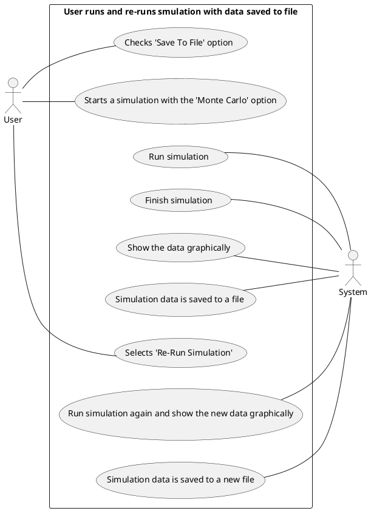
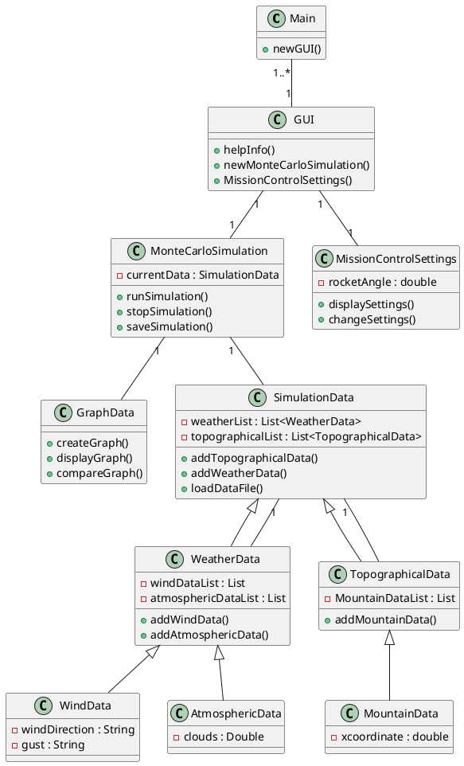

# ENGR 301 Project 15 Project Proposal and Requirements Document

**Authors**:

Max McMurray, Georgia Strongman, Michael Behan, Alexander Pace, Jacqueline Dong, Justina Koh

## 1. Introduction

Throughout the World, rockets are used for a plethora of reasons: to launch satellites, human spaceflight, and space exploration to name a few. The process of building and launching rockets is incredibly expensive, and so it is paramount to factor in all possible conditions and outcomes that could occur when launching a rocket.

The project designed by the Course Coordinator is triadic: the first part involves the actual building of the rocket, the second part involves the programming of the rocket, and the third part involves the use of external software to test the predictability and likelihood of success of the rocket. While these subprojects are primarily designed to be carried out individually, ultimately, communication is to occur between the three groups to create a wholly, and successfully functioning rocket.

Our group project predominantly focuses on the use of Monte Carlo simulations \[1\] to help design the rocket. These simulations are used to model the probability of different outcomes based on a range of variables that could affect the rocket launch such as the wind-speed, wind-direction, and weather conditions.

### Client

Andre Geldenhuis is our client for this project \[2\].

|                |                            |
| -------------- | -------------------------- |
| Client         | Andre Geldenhuis           |
| Email          | andre.geldenhuis@vuw.ac.nz |
| Mattermost tag | @geldenan                  |

### 1.1 Purpose

Design Monte Carlo simulation \[1\] software which will statistically predict the rocket's flight and landing performance, and automatically generate the control parameters for the avionics to aid in launching a hobby rocket \[2\].

### 1.2 Scope

A plugin for OpenRocket \[3\] that utilizes pre-existing frameworks to run simulations according to the Monte Carlo \[1\] method. The simulation will take into account basic weather data (for example wind and atmospheric conditions) and be contextualized  within the launch site's topography. Integration with controller software will be provided, allowing controlled motor gimballing to be included in the simulation. Flight performance and path data will be presented in a graphical format, with a focus on the rocket's predicted landing site.

### 1.3 Product overview

The part that we are designing is a sub-element of an overall project, and it has been created so that it has the ability to work in conjunction with a larger rocket system that other groups are working on. The over branching theme of the project is to be able to create a rocket that is able to successfully launch outside with the given conditions.

Rockets are incredibly costly and require a lot of time and manpower in order to create. Additionally, a failing rocket can have disastrous consequences, and therefore when building a rocket it is essential that all possible variables and factors are considered to prevent any sort of failure. To help prevent rocket failure, we have been assigned a project which will help determine two things, where the rocket will land after being launched, and the estimates required for the PID controller in the motor. The first part uses _Monte Carlo_ simulations to factor in all possible variables to predict the possible landing positions of a rocket. This should be carried out with automation, and result in a scatter plot which gives us a range of the possible positions the rocket can land in. The second part of our project should find the correct variables for the PID motor in the rocket.

The function of our project is so that physical testing will not be needed on launch day. This is due to the fact that physical testing can be costly, and in a real-life situation it is simply not viable to have physical testing done before launching the ‘real product’. Additionally, external factors are constantly changing e.g. wind speed, etc. and therefore even if physical testing was possible, it would be close to impossible to recreate the conditions in which we were testing for the final product. The use of Monte Carlo simulations does this for us. It creates a series of scenarios which consider all the possible factors in order to determine a landing spot for the rocket. This information can then be used to determine the power of which the motors should be running for a successful rocket launch.

#### 1.3.1 Product perspective

The product overview defines the product perspective, functions, user characteristics, and limitations of the system we are designing.

The system that we are designing is a sub-element of the larger system, and it has been created so that it has the ability to work in conjunction with a larger rocket system that other groups are working on. The over branching theme of the project is to be able to create a rocket that is able to successfully launch outside with the given conditions. The simulation software we are designing will statistically predict the rocket's flight and help design the control parameters for the avionics.

Rockets are incredibly costly and require a lot of time and manpower in order to create. Additionally, a failing rocket can have disastrous consequences, and therefore when building a rocket it is essential that all possible variables and factors are considered to prevent any sort of failure. To help prevent rocket failure, we have been assigned a project which will help determine two things, where the rocket will land after being launched, and the estimates required for the PID controller in the motor.

The first part uses _Monte Carlo_ simulations \[1\] to factor in all possible variables to predict the possible landing positions of a rocket. This should be carried out with automation, and result in a scatter plot which gives us a range of the possible positions the rocket can land in. The second part of our project should find the correct variables for the PID motor in the rocket.

In order to generate the correct variables for the PID motor controller, we will need to work in collaboration with the Mission Control teams and integrate our simulation software with their software. The success of the rocket flight simulations will be dependent on the design and union of both software systems.

#### 1.3.2 Product functions

The main functions of the product are range safety and site selection through Monte Carlo simulation \[1\] methodologies, in conjunction with incorporating a PID controller to allow for control tuning and design in the simulation.

The function of our project is so that physical testing will not be needed on launch day. This is due to the fact that physical testing can be costly, and in a real-life situation it is simply not viable to have physical testing done before launching the ‘real product’. Additionally, external factors are constantly changing e.g. wind speed, etc. and therefore even if physical testing was possible, it would be close to impossible to recreate the conditions in which we were testing for the final product. The use of Monte Carlo simulations does this for us. It creates a series of scenarios that consider all the possible factors in order to determine a landing spot for the rocket.

We will simulate the rocket in OpenRocket \[3\] to create a graphical output of predicted landing locations, by varying parameters. These parameters will include basic weather data, parachute ejection time, launch angle, and motor performance. By automatically generating and optimizing these parameters, the safety and performance of each simulated flight can be determined from the graphical output. This allows the optimal combination of parameters to be established prior to the launch of the physical rocket.

To meet the requirements of the minimum viable product, the Monte Carlo simulation \[1\] will:

- Automatically generate various parameters for the rocket simulation.
- Create a graphical output of predicted landing locations from the various parameters generated.

The main function of the PID controller is to simulate the controller and determine estimates for the controller parameters. This is achieved in OpenRocket through the use of simulation listeners.

To meet the requirements of the minimum viable product, the PID controller will:

- Determine estimates for the PID controller parameters through simulation listeners.

#### 1.3.3 User characteristics

This project will be all open source and as such will need to use open source tools to make it accessible to the community, such as OpenRocket \[3\]. OpenRocket is a program for all model-rocketeers who intend to estimate their rocket's performance before physically building and flying it. The user should have a general understanding of how to use this software, however, there are no educational requirements as this is an open-source project. This system may have users with or without OpenRocket experience. Technical expertise will be required while installing and understanding the functions within the system. Users should be familiar with Monte Carlo simulations and PID controllers as well as understanding how they work.

#### 1.3.4 Limitations

There are very many possible limitations of the product.

Firstly, there are a few limitations that may occur with the overall project. These are listed below:

- We are supposed to work in conjunction with other groups. However, due to the recent pandemic, it will be significantly harder to be able to collaborate and share our code with other groups, particularly those that are working with physical hardware.
- There is a limited time-frame for the creation of the product. While time-frames are also expected in a real-world situation, our time-frame is significantly shorter than given if this were to be carried out with a real rocket. This means that there will be significant cuts needed to be made over what we will be able to include in the product.

Secondly, there are limitations with the _Monte Carlo_simulations \[1\]. Such examples of these limitations are listed below:

- Monte Carlo simulations can be complex, and if a proper understanding of the way the program works is not developed, then that can result in an incorrect implementation of the program, and therefore incorrect estimates.
- Values produced by the Monte Carlo simulations are _estimates_. They are not exact values. We need to be able to account for this fact when using the Monte Carlo values.

There are also possible limitations of the final product:

- During the launch of the rocket, the rocket will be sending real-time data back from its current location to the computer used to launch it. This means that it is likely to result in a time-delay between what is currently being picked up by the rocket, and the time that the computer receives this information.
- Additionally, there is the possibility of interference being picked up as the data is being transmitted / the data being lost.

## 2. References

\[1\] A. Pace, "Monte Carlo Simulation", May, 2020. \[Online\]. Available: <https://gitlab.ecs.vuw.ac.nz/course-work/engr300/2020/group15/group-15/-/wikis/Research/Monte-Carlo-Simulation>. \[Accessed May. 20, 2020\].

\[2\] A. Geldenhuis, "Rocket Project Intro", Date unknown. \[Online\]. Available: <https://andre-geldenhuis.github.io/rocket-intro-2020-slides/index.html>. \[Accessed May. 20, 2020\].

\[3\] M. Behan, "OpenRocket - Extending OpenRocket", May, 2020. \[Online\]. Available: <https://gitlab.ecs.vuw.ac.nz/course-work/engr300/2020/group15/group-15/-/wikis/Research/OpenRocket>. \[Accessed May. 20, 2020\].

\[4\] G. Strongman, "Ergonomics and Safe Computer Usage", May, 2020. \[Online\]. Available: <https://gitlab.ecs.vuw.ac.nz/course-work/engr300/2020/group15/group-15/-/wikis/Other/Ergonomics-and-Safe-Computer-Usage>. \[Accessed May. 20, 2020\].

\[5\] Victoria University of Wellington, "Project Management - Health and Safety", 2020. \[Online\]. Available: <https://ecs.wgtn.ac.nz/Courses/ENGR301_2020T1/HealthAndSafety>. \[Accessed May. 22, 2020\].

\[6\] Quinlan, B., 2015. Dimensional Analysis: How Many Monte Carlo Simulations Should I Run? Part 2. \[Online\] Blog.3dcs.com. Available at: <https://blog.3dcs.com/dimensional-analysis-how-many-monte-carlo-simulations-should-i-run> \[Accessed 3 June 2020\].

## 3. Specific requirements

20 pages outlining the requirements of the system. You should apportion these pages across the following subsections to focus on the most important parts of your product.

### 3.1 External interfaces

OpenRocket is a Java executable and so runs on all desktop systems that support Java, including Windows, MacOS, and most Linux distributions. The interface for OpenRocket, and thus our extension, is a standard desktop environment. The individual interfaces for this environment are subject to a large variation in specifications. The interfaces are:

- **Monitor**: At least standard definition, likely high definition or above.
- **Keyboard**: Likely QWERTY, could be other layouts. We will only be designing for keyboards that use the Latin Alphabet.
- **Mouse**: Specification for the mouse is irrelevant as long as it provides two axes of movement.

### 3.2 Functions

#### Persona scale

Typical users scale from experienced with model rocket use to people just starting. They also scale in their confidence in computer usage.

#### Use Cases

##### User runs and re-runs simulation with data saved to file

| Persona/User                                           | System Response                                        |
| ------------------------------------------------------ | ------------------------------------------------------ |
| User checks 'Save To File' option                      |                                                        |
| User starts a simulation with the 'Monte Carlo' option |                                                        |
|                                                        | Run simulation                                         |
|                                                        | Finish simulation                                      |
|                                                        | Show the data graphically                              |
|                                                        | Simulation data is saved to a file                     |
| User selects 'Re-Run Simulation'                       |                                                        |
|                                                        | Run simulation again and show the new data graphically |
|                                                        | Simulation data is saved to a file                     |

##### User runs and re-runs simulation

| Persona/User                                           | System Response                                        |
| ------------------------------------------------------ | ------------------------------------------------------ |
| User starts a simulation with the 'Monte Carlo' option |                                                        |
|                                                        | Run simulation                                         |
|                                                        | Finish simulation                                      |
|                                                        | Show the data graphically                              |
| User selects 'Re-Run Simulation'                       |                                                        |
|                                                        | Run simulation again and show the new data graphically |

##### User runs simulation and saves to file

| Persona/User                                           | System Response                    |
| ------------------------------------------------------ | ---------------------------------- |
| User starts a simulation with the 'Monte Carlo' option |                                    |
|                                                        | Run simulation                     |
|                                                        | Finish simulation                  |
|                                                        | Show the data graphically          |
| User selects 'Save to File'                            |                                    |
|                                                        | Simulation data is saved to a file |

##### User runs simulation

| Persona/User                                           | System Response           |
| ------------------------------------------------------ | ------------------------- |
| User starts a simulation with the 'Monte Carlo' option |                           |
|                                                        | Run simulation            |
|                                                        | Finish simulation         |
|                                                        | Show the data graphically |

##### User finishes simulation early

| Persona/User                                           | System Response           |
| ------------------------------------------------------ | ------------------------- |
| User starts a simulation with the 'Monte Carlo' option |                           |
|                                                        | Run simulation            |
| User finishes simulation early                         |                           |
|                                                        | Finish simulation early   |
|                                                        | Show the data graphically |

##### User aborts simulation

| Persona/User                                           | System Response  |
| ------------------------------------------------------ | ---------------- |
| User starts a simulation with the 'Monte Carlo' option |                  |
|                                                        | Run simulation   |
| User aborts simulation                                 |                  |
|                                                        | Abort simulation |
|                                                        | Throw away data  |

##### User gets help

| Persona/User                                           | System Response           |
| ------------------------------------------------------ | ------------------------- |
| User selects 'help'                                    |                           |
|                                                        | Show help info screen     |
| User starts a simulation with the 'Monte Carlo' option |                           |
|                                                        | Run simulation            |
|                                                        | Finish simulation         |
|                                                        | Show the data graphically |

##### User adds topographical data

| Persona/User                          | System Response                                    |
| ------------------------------------- | -------------------------------------------------- |
| User selects 'add topographical data' |                                                    |
|                                       | Prompt for launch site location                    |
| User enters launch site location      |                                                    |
| User selects 'continue'               |                                                    |
|                                       | Save topographical data to working simulation file |

##### User adds weather data

(*Discuss with mission control group*)

| Persona/User                    | System Response                              |
| ------------------------------- | -------------------------------------------- |
| User selects 'add weather data' |                                              |
| User selects 'continue'         |                                              |
|                                 | Save weather data to working simulation file |

##### User integrates mission control

| Persona/User                                           | System Response                                      |
| ------------------------------------------------------ | ---------------------------------------------------- |
| User selects mission control options                   |                                                      |
|                                                        | Show settings for controlling rocket                 |
| User starts a simulation with the 'Monte Carlo' option |                                                      |
|                                                        | Run simulation                                       |
|                                                        | User selected controller adjusts the angle of rocket |
|                                                        | Finish simulation                                    |
|                                                        | Show the data graphically                            |

##### User integrates multiple mission control options across multiple simulations

| Persona/User                                           | System Response                                      |
| ------------------------------------------------------ | ---------------------------------------------------- |
| User selects mission control options                   |                                                      |
|                                                        | Show settings for controlling rocket                 |
| User starts a simulation with the 'Monte Carlo' option |                                                      |
|                                                        | Run simulation                                       |
|                                                        | User selected controller adjusts the angle of rocket |
|                                                        | Finish simulation                                    |
|                                                        | Show the data graphically                            |
| Re run simulation with different controller options    |                                                      |
|                                                        | Run simulation                                       |
|                                                        | User selected controller adjusts the angle of rocket |
|                                                        | Finish simulation                                    |
|                                                        | Show the comparison data graphically                 |

### 3.3 Usability Requirements

#### Objective

We want to create an extension to the OpenRocket application, this extension will be accessible to the rocket community due to the extension's code being open source.
This extension will be able to be applied to any rocket design the user imports.

#### Measurable effectiveness

The extension should run at the same time the OpenRocket simulation runs without a delay.
When the Monte Carlo simulation is run over a long period of time it is expected that the program will finish without crashing and would have run without any errors. We can measure the effectiveness by simulating the rocket and displaying the data and seeing if the results match up with the real launch.

#### Efficiency

It is expected that the program should run the simulations as fast as possible with the only limitation being the speed of the hardware.
After each simulation is run in the Monte Carlo process, the data will be stored and only until the Monte Carlo simulation has finished the data will be displayed graphically this is to avoid taking up resources that should be used for running each simulation at its maximum speed.

#### Satisfaction criteria

For the system to meet satisfaction it needs to meet the following criteria, the program should calculate and display graphically where the rocket will land when the user wants to find out where their rocket will end up for the current weather conditions.
The program should take in the values the user provides and simulate the rocket with the conditions and run the Monte Carlo simulation for the number of times specified.

### 3.4 Performance requirements

#### Capacity

The system being created will be downloaded and installed to the plugins directory of OpenRocket on the user’s device. As such, the system will support 1 terminal per installation of the software, as in the terminal that the software is installed on.

The system will handle 1 simultaneous user per installation (1 simultaneous user per terminal).

The system will run on Windows, Mac, and Linux devices.

#### Information Handling

The system will handle the user’s rocket information, including details about the rocket to be simulated to pass to OpenRocket.

The system will handle PID values/control software, to properly simulate how the rocket is likely to act in flight with this PID software controlling the gimballing. This will allow avionics to understand how the PID controller parameters should be constructed on the rocket.

The system will handle mission control data, including weather conditions. Primarily, wind information will be handled as this is the most influential to the simulations.

The system will handle the simulation data from OpenRocket across all the Monte Carlo simulations. This will then be converted to graphical data, to be stored for the user and displayed graphically for ease of understanding. The simulation data should be saved regularly, so in the case of crashing, early termination, or other issues, the information gathered to that point is preserved for the user.

#### Dynamic Requirements

The system will allow a degree of flexibility to the user in terms of the number of Monte Carlo simulations to be run. There will be a maximal limit of 1,000,000,000 (one billion), and a lower limit of 100 (one hundred). This will allow the user to test the program, or test a new idea, in a short amount of time. This will also allow the user to run an extremely long Monte Carlo simulation to gain an idea of certainty in what will happen. The default number will be 1,000 (1 thousand), as this is enough simulations to gather a reasonable idea of what will happen, but will take a short amount of time (30 seconds) to run, giving the user a chance to test out an idea without the inconvenience of having to wait a long time.

The system should run/process one thousand (1,000) simulations in 30 seconds or less. This will mean that each simulation should take 0.03 seconds, and two thousand (2,000) simulations should run per minute.
Refer to the table below for a range of time estimates for different Monte Carlo simulation sizes.

| Simulation Count (Numerical) | Simulation Count | Time Estimate (Seconds) | Time Estimate (Minutes) | Time Estimate (Hours) |
| ---------------------------- | ---------------- | ----------------------- | ----------------------- | --------------------- |
| 1                            | One              | 0.03                    | 0.0005                  | -                     |
| 100                          | One hundred      | 3                       | 0.05                    | -                     |
| 1,000                        | One thousand     | 30                      | 0.5                     | -                     |
| 10,000                       | Ten thousand     | 300                     | 5                       | -                     |
| 1,000,000                    | One million      | 30,000                  | 500                     | 8.333                 |
| 10,000,000                   | Ten million      | 300,000                 | 5,000                   | 83.333                |
| 1,000,000,000                | One billion      | 30,000,000              | 500,000                 | 8,333.333             |

### 3.5 Logical database requirements

#### Overview Domain Model

##### Responsibilities of each class in the model

| Class                  | Brief description                                                                  |
| ---------------------- | ---------------------------------------------------------------------------------- |
| Main                   | Runs the overall system.                                                           |
| GUI                    | Allows the user to navigate through the system.                                    |
| MonteCarloSimulation   | Runs the Monte Carlo Simulation.                                                   |
| MissionControlSettings | Holds the information for the Mission Control Settings.                            |
| GraphData              | Creates, displays and compares the graphical output of the Monte Carlo Simulation. |
| SimulationData         | Contains all of the data for the Monte Carlo Simulation.                           |
| WeatherData            | Type of Simulation Data.                                                           |
| WindData               | Type of Weather Data.                                                              |
| AtmosphericData        | Type of Weather Data.                                                              |
| TopographicalData      | Type of Simulation Data.                                                           |
| MountainData           | Type of Topographical Data.                                                        |

### 3.6 Design constraints

Many possible constraints can be imposed on the project. These can be broken down into three main sections: _constraints imposed by external standards_, _constraints imposed by regulatory requirements_ and _constraints imposed by project limitations_.

__Constraints imposed by external standards:__

- COVID-19 constraint: Due to the recent events of COVD-19, our team is also social distancing. This means that we are also constrained by our inability to carry out in-person group meetings and stand-ups, as well as group work.

__Constraint imposed by regulatory requirements:__

- Health and safety constraints: Our project must abide by all health and safety laws. This means that we are not able to carry _any_ sub-projects that may violate these rules.

__Constraints imposed by project limitations:__

- Time constraint: Our project has a very limited time frame in which it can run. This means that decisions must be made to maintain the integrity and completion of the project before the second semester is finished. Additionally, during the length of this project, our team members still have other papers to work on, and therefore we are also limited by the number of hours that our team members can put in each week.
- Cost constraint: There is are no predicted project costs for this project. This means that whatever we do in this assignment must stay budget-less.
- Knowledge constraint: There is also a knowledge constraint due to the fact that we are only in our third year of university. This means that we have limited experience in both working in a group / team environment, as well as having limited experience in professional coding.
- Technical constraint: While our project is solely software-based, we have a lack of access to professional and industry-standard machinery and software. We only have access to our personal laptops and electronics and free, open-source software.
- Agile constraint: Our project must be carried out in an agile software development method (or some form of agile such as the Kanban method). This means that we must maintain good Agile hygiene and carry out frequent stand-ups, sprints, retrospectives as well as the other aspects of Agile.

### 3.7 Non-functional system attributes

- Compatibility
- Usability
- Reliability
- Security
- Maintainability
- Portability
- Open Source
- Performance Efficiency

#### Compatibility

This project (creating Monte Carlo simulations) is one of three projects with an overarching goal of launching a hobby rocket. As such, one of the top non-functional requirements is that our program must be compatible with the other two projects.

Our program must be compatible and must coexist with the avionics and mission control projects. Specifically, we must be able to read in rocket data from the avionics team, and we must be able to read in weather condition data from the mission control team and use these data sets to construct a realistic simulation to be used to judge whether the rocket's flight path and subsequent landing zone are considered safe.

This will involve exchanging information with these project groups, and using that information in our project. Therefore, compatibility is an important systemic attribute to this project.

#### Usability

As the client (and therefore one of the main users), of this project is a hobby rocketeer, and the program is designed to be used by a variety of users with varying skill levels, the program must be user-friendly.
To be more specific, this program must be designed in a way that is easy to operate and control, and users can efficiently and effectively learn and understand how to use it.
It should also protect against simple user errors, such as invalid inputs (negative values for example).

The program should have a user interface that is accessible to most users and is understandable and reasonably intuitive to use.

As the program has one main overall function (Monte Carlo simulations of **hobby** rockets), users should be able to quickly realize/recognize whether this program is appropriate for their needs.
It should be made obvious that this program is designed for simulating hobby rockets only.

#### Reliability

The program must be able to reliably perform consecutive Monte Carlo simulations until the amount of times specified is reached.
Specifically, the program must reliably complete this task successfully without crashing or encountering issues.

The program should be widely available to use.

The program should, in the event of an interruption or failure, be able to recover and store the usable data in a way that benefits the user (for example, store the data so that it can be displayed to the user graphically even if the simulations have not all finished).

#### Security

The program should never handle user information, as it would be unnecessary to do so, which means that user information could never be stolen from our program.

The program should have integrity, meaning it should be protected against tampering and/or modification.

#### Maintainability

The program should be modular when possible so that changes to the program have a minimized impact.
The program should also be written in a way that code can be reused when possible, to avoid redundancy.

The program should be efficient and effective to analyze so that failures/deficiencies can be found and fixed efficiently, and so that modifications can be made with ease.
It is likely that modifications will need to be made, in the case of requirements changing, or having more time to implement additional features).

The program should be testable, to allow us to effectively and efficiently check whether the project requirements have been met and that our program works accurately.

#### Portability

The program should be efficient and intuitive for the user to install and have working, there should be instructions available for any steps that may not be clear to the user.

The program should be adaptable, and should not require major refactoring for small changes.

The program should be clear about the performance requirements of the machine it is running on, as Monte Carlo simulations are resource-intensive.

#### Open Source

The program should be open source and free to use, meaning that all software, tools, and equipment used to build and create the program should not conflict with this.

All software, tools, and equipment should also be open-source so that the program is free to use for hobby rocketeers and any other user who the program is appropriate for.

#### Performance Efficiency

The program must be designed with efficiency in mind.
As Monte Carlo simulations are resource-intensive and computationally stressful, the program must not use resources inefficiently and must make the best effort to reduce stress on the machine it is running on where possible.

The program should be clear to the user about the performance requirements of the machine it should be running on, as Monte Carlo simulations are resource-intensive.

### 3.8 Physical and Environmental Requirements

This is a pure software project, and so there are no physical or environmental requirements.

### 3.9 Supporting information

see 9.5.19.

## 4. Verification

This section details how we verify our product meets the requirements laid out here in this document in section 3. These verification methods will include testable acceptance criteria.

### External Interfaces (3.1)

This requirement will be verified by being able to operate the product using only a monitor, mouse, and keyboard as external interfaces, with no other interfaces needed.

### Functions (3.2)

This requirement will be verified by being able to perform all of the use cases, following all of the steps in the order presented without product failure and with successful results. It can be tested by a manual walkthrough of the product.

### Usability Requirements (3.3)

This requirement will be verified mostly by the successful verification of many of the other sections, namely parts of this section relating to sections 3.2, 3.4, and 3.7. Overall verification for this section can be achieved through team review, user testing, and customer testing.

### Performance Requirements (3.4)

This requirement will be verified by meeting the specifics detailed in section 3.3. Static attributes like those in the *Capacity* and *Information Handling* sections can be verified through manual analysis. The attribute in the *Dynamic Requirements* section can be verified through automated unit testing.

### Logical Database Requirements (3.5)

This requirement will be verified by an analysis of the product source code to identify class structure and associations between classes. Verification will be achieved if the structure and associations mostly resemble the UML diagram presented in section 3.5. Minor deviations from the diagram are permitted as the need arises during development.

### Design Constraints (3.6)

This requirement will be verified by a retrospective analysis of the team's actions and decisions. Team members could be reviewed individually, or a special meeting could be held to identify any breaches of the stated limitations.

### Non-functional System Attributes (3.7)

**Compatibility**
This requirement will be verified by the ability of the program to integrate necessary data from the avionics and mission control products. Verification will be achieved if necessary rocket data is able to be read in from the avionics product and necessary weather condition data is able to be read in from the mission control product. This can be tested with unit testing.

**Usability**
This requirement will be verified by being user-friendly and accessible. Verification will be achieved if:

- User testing indicates the product is relatively easy to use at the skill level of the user personas.
- User testing indicates the product is intuitive based on the experience of the user personas.
- User testing indicates the product doesn't have a steep learning curve, i.e. the learning process is efficient and does not contain any major barriers.
- User testing indicates the ability to quickly recognize whether the product is appropriate for their needs.
- Invalid input protections are in place, preventing the user from passing out-of-bounds or inapplicable inputs to the product. These can include things like negative values and large/small values where they are not expected. This can be tested with automated testing.
- The product's interface is accessible to most users and contains basic accessibility options like font size adjustment, colour-blindness support, and keyboard shortcuts.

**Reliability**
This requirement will be verified by mitigating the causes of program failure and being easily obtained. Verification will be achieved if:

- The product reliably performs consecutive simulations an arbitrary number of times. This number should be reasonable but is expected to be between or larger than 5,000 - 20,000 times \[6\]. This can be tested with unit testing.
- The product is widely available to use. It should be downloadable from an easily accessible website.
- The product does not lose data from the current batch of simulations in the event of failure. Data collected up to the point of failure should be stored in a usable fashion that allows it to be read and displayed.

**Security**
This requirement will be verified by the product only collecting the minimum necessary user data and employing mechanisms to maintain its integrity. Verification will be achieved if:

- An analysis and review of the user data collected by the product is able to justify the data collected as being essential to the operation of the product or essential to the user's experience of the product.
- The product has introduced methods to protect against tampering and modification without the user's consent.

**Maintainability**
This requirement will be verified by a codebase that is modular, clear, easy to read, and employs encapsulation well. Verification will be achieved if:

- An analysis of the code shows good use of encapsulation.
- Code conforms to a chosen standard (i.e. Google standard). This can be enforced with a style checker IDE plugin. For verification to be complete, no warnings from this plugin must be present.
- JavaDocs are used correctly and helpfully. This can be enforced with a style checker IDE plugin and a manual review of the codebase.
- The code not written in Java is accurately documented.
- The code is commented on where needed.

**Portability**
As the product is a Java plugin and ostensibly faces no porting during its life cycle, this requirement's verification is fulfilled by the Maintainability section above.

**Open Source**
This requirement will be verified by the ability to change any part of the product's codebase with freely available tools. The product should comply with applicable open source standards, and make its codebase available on a freely accessible online platform (like GitLab or GitHub).

**Performance Efficiency**
This requirement will be verified by a subjective analysis of several sample machines running the product in a normal scenario. The sample machines should be consistent with those used by the user personas. The product should also perform within a timeframe acceptable to the user personas, within the context of the personas being informed of the resource-intensive nature of Monte Carlo simulations.

## 5. Development schedule

### 5.1 Schedule

Key project deliverables:

| Deliverable:            | Goal Timeline:                          |
| ----------------------- | --------------------------------------- |
| Architectural Prototype | T2 Weeks 3-4 (Sprint 5)                 |
| Minimum Viable Product  | T2 Week 7-8 (Sprint 7)                  |
| Final Release           | T2 Week 11-12 (Sprint 9 - final sprint) |

Sprint schedule:

| Week:         | Sprint No:              | Goal/Progress:                                                                    |
| ------------- | ----------------------- | --------------------------------------------------------------------------------- |
| T1 Week 7     | Sprint 1                | Push to complete the bulk of the documentation                                    |
| T1 Week 8-9   | Sprint 2                | Finishing documentation and beginning programming                                 |
| T1 Week 10-11 | Sprint 3                | Transitioning from documentation to solely programming                            |
| T1 Week 12    | No sprint  (terms test) |                                                                                   |
| -BREAK-       | No sprint               |                                                                                   |
| T2 Week 1-2   | Sprint 4                | Picking up from before the break, reorienting and settling into the project again |
| T2 Week 3-4   | Sprint 5                | Working on extension architecture - architectural prototype should be ready       |
| T2 Week 5-6   | Sprint 6                | Working on extension and adding features                                          |
| T2 Week 7-8   | Sprint 7                | Working on extension and adding features - minimum viable product should be ready |
| T2 Week 9-10  | Sprint 8                | Pushing to complete additional features from project requirement                  |
| T2 Week 11-12 | Sprint 9                | Readying project for deployment and final release                                 |

A more detailed version of the sprint schedule can be found in the following link. This includes the list of scrum masters and minute takers for each sprint.

<https://gitlab.ecs.vuw.ac.nz/course-work/engr300/2020/group15/group-15/-/wikis/Project/Minute-and-Scrum-Master-Timetable>

### 5.2 Budget

As all developers are unpaid, OpenRocket \[3\] is open-source software and we will be using open-source IDEs and development tools/tools provided by the University, no budget is required.
We will ensure that any design and software choices take into account the lack of budget.

### 5.3 Risks

| Risk                                                                                                                 | Likelihood | Impact       | Mitigation                                                                                                                                                                                                                                                                                                                                                                                                                                                                                                                                                                                                                        |
| -------------------------------------------------------------------------------------------------------------------- | ---------- | ------------ | --------------------------------------------------------------------------------------------------------------------------------------------------------------------------------------------------------------------------------------------------------------------------------------------------------------------------------------------------------------------------------------------------------------------------------------------------------------------------------------------------------------------------------------------------------------------------------------------------------------------------------- |
| Sickness or other incapacitation of a team member reducing their productivity and leading to deadlines not being met | High       | Tolerable    | As we are already at home in quarantine, we are already used to working remotely, and do not need to worry about spreading any sickness. In the case that a team member is too sick to work, we should be able to rearrange duties to cover the workload as it is a team of 6 developers, and it is likely that another team member has the skills required to cover the work. We will also make an effort to keep documentation of what has been done and what is being worked on, along with having weekly stand-up meetings to discuss what is being worked on, and to keep all team members updated on the current situation. |
| The personal equipment of a team member failing (e.g. computers/internet/power loss)                                 | Moderate   | Serious      | As we are all working remotely, if a team member's personal equipment fails (such as desktop/laptop), we will have to work without them until repairs can be made. As a team of 6, we should be able to reassign duties to cover the workload between the remaining members. If a more uncontrollable event happens, such as a power-cut/loss of power, or loss of internet, to mitigate the loss of work, we will make sure to commit often so that all completed work is accessible to team members.                                                                                                                             |
| Changes to the project requirements requiring minor reworks of the system                                            | Moderate   | Tolerable    | We will maintain regular contact with the customer to ensure that we are aware and understand the customer’s needs and requirements, to avoid misunderstanding the project requirements. We will keep our program as flexible as possible, to ensure that changes to the requirements do not require large changes to our system.                                                                                                                                                                                                                                                                                                 |
| Improper use of computer equipment resulting in injury                                                               | High       | Serious      | We will ensure that all group members take regular breaks to stretch, walk around, and rest their eyes, to avoid Occupational Overuse Syndrome (OOS) and Repetitive Strain Injury (RSI).                                                                                                                                                                                                                                                                                                                                                                                                                                          |
| External tools failing to provide expected functionality (e.g. OpenRocket)                                           | Moderate   | Serious      | Before beginning to use any tool, the team will research the tool to ensure that it will provide the functionality we need and that we understand the capabilities provided by the tool.                                                                                                                                                                                                                                                                                                                                                                                                                                          |
| The time required to develop the software is underestimated                                                          | High       | Serious      | The team will regularly review the progress we have made at each weekly meeting to ensure that we are making sufficient progress on the project according to our estimates. If we have underestimated the time requirement, this will become clear and we will be able to compensate accordingly                                                                                                                                                                                                                                                                                                                                  |
| Team members have other commitments come up leading to not having enough time to commit to working on the project    | Moderate   | Tolerable    | The team will keep open communication about outside commitments so that only a reasonable time commitment is expected of each member per week. If necessary, we will adjust the duties of overburdened members to keep the workload reasonable.                                                                                                                                                                                                                                                                                                                                                                                   |
| A skill is required for the project that no team member can provide                                                  | Low        | Catastrophic | The team will keep communication open so that we are aware of each member's skills and abilities, along with their skill level in certain areas. This will mean we are able to effectively choose certain tools and languages for the project that complement our skills.                                                                                                                                                                                                                                                                                                                                                         |
| New team members or team members leaving the project                                                                 | Low        | Tolerable    | The team will commit work regularly and keep clear documentation of progress, so that team member changes mean duties can be picked up smoothly, and that no work is lost.                                                                                                                                                                                                                                                                                                                                                                                                                                                        |
| Updates to external tools causing issues with the project                                                            | Low        | Serious      | The team will keep up-to-date with any changes made to tools, and if necessary, change tools to something that will be compatible with the project.                                                                                                                                                                                                                                                                                                                                                                                                                                                                               |

### 5.4 Health and Safety

To manage computer-related risks, all team members will take regular breaks (standing up, walking around, stretching, resting eyes, etc.), to avoid Occupational Overuse Syndrome (OOS) and Repetitive Strain Injury (RSI).
We will ensure deadlines are realistic and allow time to take breaks as appropriate. Each team member will make the best effort possible to arrange their workspace ergonomically. The team will discuss and provide resources on how to accomplish this. One such resource is the Wiki page 'Ergonomics and Safe Computer Usage' \[4\], available in the Other section of the project Wikis.

All work will be done remotely at each team member's place of residence. The project will not require work at any external workplaces/sites, and so will not require any Health and Safety inductions.

The project will not require any human or animal experimentation.

Any incidents will be reported to the Victoria University of Wellington Safety Officer (Roger Cliffe - ecs-safety@ecs.vuw.ac.nz), Head of School Stuart Marshall, and Course Coordinator Aaron Chen in accordance with the Project Management Health and Safety Guide \[5\].

#### 5.4.1 Safety Plans

The project is purely software, therefore project requirements do not involve risk of death, serious harm, harm, or injury.

## 6. Appendices

### 6.1 Assumptions and dependencies

### 6.2 Acronyms and abbreviations

OpenRocket \[3\] - a rocket simulation software.

Monte Carlo \[1\] - a method of simulation.

## 7. Contributions

A one page statement of contributions, including a list of each member of the group and what they contributed to this document.

| Contributor | Sections                                                                                                   |
| :---------: | :--------------------------------------------------------------------------------------------------------- |
|   Michael   | 1.0, 1.1, 1.2, 7. Contributions, OpenRocket wiki, 3.2, 3.3                                                 |
|    Alex     | 1.0, 1.1, 1.2, 7. Contributions, Monte Carlo wiki page, 3.1, 3.2, Section 4                                |
|   Georgia   | 1.0, 1.1, 2, Section 5 (5.1, 5.2, 5.3, 5.4, 5.4.1), 3.2, 3.4, 3.7, 3.8, 5.1, Safe Computing Wiki (for H&S) |
|     Max     | 1.0, 1.1, Section 5 (5.1, 5.2, 5.3, 5.4, 5.4.1), 3.2                                                       |
|   Justina   | 1.0, 1.1, Section 1 (1.2, 1.3, 1.3.1, 1.3.2, 1.3.3, 1.3.4), 3.6                                            |
|   Jacqui    | 1.0, 1.1, Section 1 (1.2, 1.3, 1.3.1, 1.3.2, 1.3.3, 1.3.4), 3.5, 3.2                                       |

---
