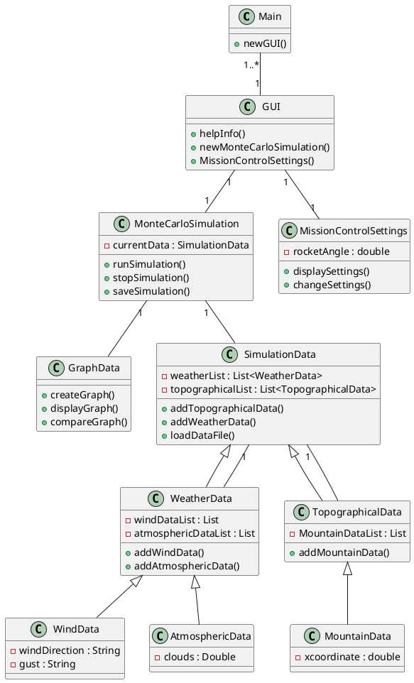

# ENGR 301: Project Requirements Document

The aim of this document is to specify the requirements of the system your group is to build. The focus of a requirements document is the problem you are attempting to solve:  not a first attempt at a solution to that problem. This document should communicate clearly to the supervisor, client and course coordinator what the system you build is going to do, and what constraints it must meet while doing so.

The document should also demonstrate your understanding of the main analysis principles and quality guidelines, and applicable standards, using tools and notations as necessary to communicate the requirements precisely, unambiguously and clearly in a written technical document. Page specifications below are *limits not targets* and refer to the pages in the PDF generated from the markdown. Because the size of your document is necessarily limited, you should ensure that you focus your efforts on those requirements that are most important to completing a successful system: if sections are at their page limit, indicate how many items would be expected in a complete specification. 

The ENGR 301 project proposal and requirements document should be based on the standard ISO/IEC/IEEE 29148:2011(E), primarily sections 8.4 and 9.5, plus section 9.4 for projects involving hardware and ISO 25010 SQuaRE for systemic requirements. While excerpts from the standard have been quoted within the template, to understand what is required it will be necessary to read earlier sections of the standards themselves. A supplementary treatment of requirements gathering in engineering projects may be found in [Requirements in Engineering Projects](https://victoria.rl.talis.com/items/F166DA94-DAD8-FBDB-0785-7A63C9BA3603.html?referrer=%2Flists%2F5886F297-2506-1F17-45D9-7F04CEE284EE.html%23item-F166DA94-DAD8-FBDB-0785-7A63C9BA3603) (Talis). The requirements document should contain the sections listed below, and conform to the formatting rules listed at the end of this brief. 

All team members are expected to contribute equally to the document and list their contributions in section 6 of the document. You should work on your document in your team's GitLab repository. While collective contributions are expected to be the exception rather than the rule, if more than one team member has contributed to a particular commit then all those team member IDs should be included in the first line of the git commit message. `git blame`, `git diff`, file histories, etc. will be tools used to assess individual contributions, so everyone is encouraged to contribute individually, commit early and commit often. Any team wishing to separate individually contributed sections into a single file before collation into the single proposal document for submission is welcome to do so.

---

# ENGR 301 Project 15 Project Proposal and Requirements Document
#### Author list, a comma-separated list of the names of each member of the team.

Max McMurray, Georgia Strongman, Michael Behan, Alexander Pace, Jacqueline Dong, Justina Koh

## 1. Introduction

Throughout the World, rockets are used for a plethora of reasons: to launch satellites, human spaceflight and space exploration to name a few. The process of building and launching rockets is incredibly expensive, and so it is paramount to factor in all possible conditions and outcomes that could occur when launching a rocket. 

The project designed by the Course Coordinator is triadic: the first part involves the actual building of the rocket, the second part involves the programming of the rocket, and the third part involves the use of external software to test the predictability and likelihood of success of the rocket. While these subprojects are primarily designed to be carried out individually, ultimately, communication is to occur between the three groups to create a wholly, and successfully functioning rocket. 

Our group project predominantly focuses on the use of Monte Carlo simulations [1] to help design the rocket. These simulations are used to model the probability of different outcomes based on a range of variables that could affect the rocket launch such as the wind-speed, wind-direction and weather conditions. 

### Client

Andre Geldenhuis is our client for this project [2].

| | |
|---|---|
| Client | Andre Geldenhuis |
| Email | andre.geldenhuis@vuw.ac.nz |
| Mattermost tag | @geldenan |

### 1.1 Purpose

Design Monte Carlo simulation [1] software which will statistically predict the rocket's flight and landing performance, and automatically generate the control parameters for the avionics to aid in launching a hobby rocket [2].

### 1.2 Scope

A plugin for OpenRocket [3] that utilises pre-existing frameworks to run simulations according to the Monte Carlo [1] method. The simulation will take into account basic weather data (for example wind and atmospheric conditions) and be contextualised within the launch site's topography. Integration with controller software will be provided, allowing controlled motor gimballing to be included in the simulation. Flight performance and path data will be presented in a graphical format, with a focus on the rocket's predicted landing site.

### 1.3 Product overview 

The product overview defines the product perspective, functions, user characteristics and limitation of the system we are designing.

#### 1.3.1 Product perspective

*One page defining the system's relationship to other related products (9.5.3. but not the subsections in the standard.)*

The system that we are designing is a subelement of the larger system, and it has been created so that it has the ability to work in conjunction with a larger rocket system which other groups are working on. The overbranching theme of the project is to be able to create a rocket which is able to successfully launch outside with the given conditions. The simulation software we are designing will statistically predict the rocket's flight and help design the control parameters for the avionics. 

Rockets are incredibly costly and require a lot of time and manpower in order to create. Additionally, a failing rocket can have disastrous consequences, and therefore when building a rocket it is essential that all possible variables and factors are considered to prevent any sort of failure. To help prevent rocket failure, we have been assigned a project which will help determine two things, where the rocket will land after being launched, and the estimates required for the PID controller in the motor.

The first part uses _Monte Carlo_ simulations [1] to factor in all possible variables to predict the possible landing positions of a rocket. This should be carried out with automation, and result in a scatter plot which gives us a range of the possible positions the rocket can land in. The second part of our project should find correct variables for the PID motor in the rocket. 

In order to generate the correct variables for the PID motor controller, we will need to work in collaboration with the Mission Control teams and integrate our simulation software with their software. The success of the rocket flight simulations will be dependent on design and union of both software systems. 

#### 1.3.2 Product functions

*One page summary of the main functions of the product (9.5.4), briefly characterising the minimum viable product.*

The main functions of the product are range safety and site selection through Monte Carlo simulation [1] methodologies, in conjunction with incorporating a PID controller to allow for control tuning and design in the simulation.

The function of our project is so that physical testing will not be needed on launch day. This is due to the fact that physical testing can be costly, and in a real life situation it is simply not viable to have physical testing done before launching the ‘real product’. Additionally, external factors are constantly changing e.g. wind speed etc. and therefore even if physical testing was possible, it would be close to impossible to recreate the conditions in which we were testing for the final product. The use of Monte Carlo simulations does this for us. It creates a series of scenarios which consider all the possible factors in order to determine a landing spot for the rocket. 

We will simulate the rocket in OpenRocket [3] to create a graphical output of predicted landing locations, by varying parameters. These parameters will include basic weather data, parachute ejection time, launch angle and motor performance. By automatically generating and optimizing these parameters, the safety and performance of each simulated flight can be determined from the graphical output. This allows the optimal combination of parameters to be established prior to the launch of the physical rocket.

To meet the requirements of the minimum viable product, the Monte Carlo simulation [1] will:
- Automatically generate various parameters for the rocket simulation.
- Create a graphical output of predicted landing locations from the various parameters generated.

The main function of the PID controller is to simulate the controller and determine estimates for the controller parameters. This is achieved in OpenRocket through the use of simulation listeners. 

To meet the requirements of the minimum viable product, the PID controller will:
- Determine estimates for the PID controller parameters through simulation listeners.

#### 1.3.3 User characteristics   

*One page identifying the main classes of users and their characteristics (9.5.5)*

This project will be all open source and as such will need to use open source tools to make it accessible to the community, such as OpenRocket [3]. OpenRocket is a program for all model-rocketeers who intend to estimate their rocket's performance before physically building and flying it. The user should have a general understanding on how to use this software, however there are no educational requirements as this is an open source project. This system may have users with or without OpenRocket experience. Technical expertise will be required while installing and understanding the functions within the system. Users should be familiar with Monte Carlo simulations and PID controllers as well as understanding how they work.

#### 1.3.4 Limitations

*One page on the limitations on the product (9.5.6)*

There are very many possible limitations of the product. 

Firstly, there are a few limitations that may occur with the overall project. These are listed below:
- We are supposed to work in conjunction with other groups. However, due to the recent pandemic, it will be significantly harder to be able to collaborate and share our code with other groups, particularly those that are working with physical hardware. 
- There is a limited time-frame to the creation of the product. While time-frames are also expected in a real world situation, our time-frame is significantly shorter than given if this were to be carried out with a real rocket. This means that there will be significant cuts needed to be made over what we will be able to include in the product. 

Secondly, there are limitations with the _Monte Carlo_simulations [1]. Such examples of these limitations are listed below:
- Monte Carlo simulations can be complex, and if a proper understanding of the way the program works is not developed, then that can result in incorrect implementation of the program, and therefore incorrect estimates.
- Values produced by the Monte Carlo simulations are _estimates_. They are not exact values. We need to be able to account for this fact when using the Monte Carlo values.

There are also possible limitations of the final product:
- During the launch of the rocket, the rocket will be sending real-time data back from its current location to the computer used to launch it. This means that it is likely to result in a time-delay between what is currently being picked up by the rocket, and the time that the computer receives this information. 
- Additionally, there is the possibility of interference being picked up as the data is being transmitted / the data being lost. 

## 2. References

[1] A. Pace, "Monte Carlo Simulation", May, 2020. [Online]. Available: https://gitlab.ecs.vuw.ac.nz/course-work/engr300/2020/group15/group-15/-/wikis/Research/Monte-Carlo-Simulation. [Accessed May. 20, 2020].

[2] A. Geldenhuis, "Rocket Project Intro", Date unknown. [Online]. Available: https://andre-geldenhuis.github.io/rocket-intro-2020-slides/index.html. [Accessed May. 20, 2020].

[3] M. Behan, "OpenRocket - Extending OpenRocket", May, 2020. [Online]. Available: https://gitlab.ecs.vuw.ac.nz/course-work/engr300/2020/group15/group-15/-/wikis/Research/OpenRocket. [Accessed May. 20, 2020].

[4] G. Strongman, "Ergonomics and Safe Computer Usage", May, 2020. [Online]. Available: https://gitlab.ecs.vuw.ac.nz/course-work/engr300/2020/group15/group-15/-/wikis/Other/Ergonomics-and-Safe-Computer-Usage. [Accessed May. 20, 2020]

## 3. Specific requirements  

20 pages outlining the requirements of the system. You should apportion these pages across the following subsections to focus on the most important parts of your product.

### 3.1 External interfaces

See 9.5.10. for most systems this will be around one page. 

### 3.2 Functions
*This is typically the longest subsection in the document. List up to fifty use cases (in order of priority for development), and for at least top ten focal use cases, write a short goal statement and use case body (up to seven pages).  Identify the use cases that comprise a minimum viable product.*

##### Persona scale
Typical users scale from experienced with model rocket use to people just starting. They also scale in their confidence in computer usage.

##### Use Cases

User runs and re-runs simulation with data saved to file

| Persona/User | System Response |
|---|---|
| User checks 'Save To File' option | |
| User starts a simulation with the 'Monte Carlo' option | |
| | Run simulation |
| | Finish simulation |
| | Show the data graphically |
| | Simulation data is saved to a file |
| User selects 'Re-Run Simulation' | |
| | Run simulation again and show the new data graphically |
| | Simulation data is saved to a file |

User runs and re-runs simulation

| Persona/User | System Response |
|---|---|
| User starts a simulation with the 'Monte Carlo' option | |
| | Run simulation |
| | Finish simulation |
| | Show the data graphically |
| User selects 'Re-Run Simulation' | |
| | Run simulation again and show the new data graphically |

User runs simulation and saves to file

| Persona/User | System Response |
|---|---|
| User starts a simulation with the 'Monte Carlo' option | |
| | Run simulation |
| | Finish simulation |
| | Show the data graphically |
| User selects 'Save to File' | |
| | Simulation data is saved to a file |

User runs simulation

| Persona/User | System Response |
|---|---|
| User starts a simulation with the 'Monte Carlo' option | |
| | Run simulation |
| | Finish simulation |
| | Show the data graphically |

User finishes simulation early

| Persona/User | System Response |
|---|---|
| User starts a simulation with the 'Monte Carlo' option | |
| | Run simulation |
| User finishes simulation early ||
| | Finish simulation early |
| | Show the data graphically |

User aborts simulation

| Persona/User | System Response |
|---|---|
| User starts a simulation with the 'Monte Carlo' option | |
| | Run simulation |
| User aborts simulation ||
| | Abort simulation |
| | Throw away data |

User gets help

| Persona/User | System Response |
|---|---|
| User selects 'help' ||
| | Show help info screen |
| User starts a simulation with the 'Monte Carlo' option | |
| | Run simulation |
| | Finish simulation |
| | Show the data graphically |

User adds topographical data

| Persona/User | System Response |
|---|---|
| User selects 'add topographical data' ||
||Prompt for launch site location|
| User enters launch site location||
|User selects 'continue'||
||Save topographical data to working simulation file|

User adds weather data

| Persona/User | System Response |
|---|---|
| User selects 'add weather data' ||
|User selects 'continue'||
||Save weather data to working simulation file|

*Discuss with mission control group*

User integrates mission control

| Persona/User | System Response |
|---|---|
| User selects mission control options ||
| | Show settings for controlling rocket |
| User starts a simulation with the 'Monte Carlo' option | |
| | Run simulation |
| | User selected controller adjusts the angle of rocket |
| | Finish simulation |
| | Show the data graphically |

User integrates multiple mission control options across multiple simulations

| Persona/User | System Response |
|---|---|
| User selects mission control options ||
| | Show settings for controlling rocket |
| User starts a simulation with the 'Monte Carlo' option | |
| | Run simulation |
| | User selected controller adjusts the angle of rocket |
| | Finish simulation |
| | Show the data graphically |
| Re run simulation with different controller options | |
| | Run simulation |
| | User selected controller adjusts the angle of rocket |
| | Finish simulation |
| | Show the comparison data graphically |

### 3.3 Usability Requirements

See 9.5.12. for most systems this will be around one page.

> **9.5.12 Usability requirements** 
> Define usability (quality in use) requirements. Usability requirements and objectives for the software system include measurable effectiveness, efficiency, and satisfaction criteria in specific contexts of use.

### 3.4 Performance requirements

See 9.5.13. for most systems this will be around one page. Hardware projects also see section 9.4.6.

> **9.5.13 Performance requirements**  
> Specify both the static and the dynamic numerical requirements placed on the software or on human interaction with the software as a whole. 
> 
> Static numerical requirements may include the following:
> 
> a) The number of terminals to be supported;  
> b) The number of simultaneous users to be supported;  
> c) Amount and type of information to be handled.
> 
> Static numerical requirements are sometimes identified under a separate section entitled Capacity.
> 
> Dynamic numerical requirements may include, for example, the numbers of transactions and tasks and the amount of data to be processed within certain time periods for both normal and peak workload conditions. The performance requirements should be stated in measurable terms.
> 
>  For example, "_95 % of the transactions shall be processed in less than 1 second._" rather than, "An operator shall not have to wait for the transaction to complete."
> 
> NOTE Numerical limits applied to one specific function are normally specified as part of the processing subparagraph description of that function.

### 3.5 Logical database requirements

*See 9.5.14. for most systems, a focus on d) and e) is appropriate, such as an object-oriented domain analysis. You should provide an overview domain model (e.g.  a UML class diagram of approximately ten classes) and write a brief description of the responsibilities of each class in the model (3 pages).*

*You should use right tools, preferabley PlantUML, to draw your URL diagrams which can be easily embedded into a Mardown file (PlantUML is also supported by GitLab and Foswiki).*

##### Overview Domain Model

##### Responsibilities of each class in the model

| Class | Brief description |
|---|---|
| Main | Runs the overall system.|
| GUI | Allows the user to navigate through the system. |
| MonteCarloSimulation | Runs the Monte Carlo Simulation. |
| MissionControlSettings | Holds the information for the Mission Control Settings. |
| GraphData | Creates, displays and compares the graphical output of the Monte Carlo Simulation. |
| SimulationData | Contains all of the data for the Monte Carlo Simulation. |
| WeatherData | Type of Simulation Data. |
| WindData | Type of Weather Data. |
| AtmosphericData | Type of Weather Data. |
| TopographicalData | Type of Simulation Data. |
| MountainData | Type of Topographical Data. |

### 3.6 Design constraints

see 9.5.15 and 9.5.16. for most systems, this will be around one page.

> 9.5.15 Design constraints 
> Specify constraints on the system design imposed by external standards, regulatory requirements, or project limitations.
> 
> 9.5.16 Standards compliance 
> Specify the requirements derived from existing standards or regulations, including:
> 
> a) Report format; 
> b) Data naming; 
> c) Accounting procedures; 
> d) Audit tracing.
> 
> For example, this could specify the requirement for software to trace processing activity. Such traces are needed for some applications to meet minimum regulatory or financial standards. An audit trace requirement may, for example, state that all changes to a payroll database shall be recorded in a trace file with before and after values.

### 3.7 Nonfunctional system attributes

Present the systemic (aka nonfunctional) requirements of the product (see ISO/IEC 25010).
List up to twenty systemic requirements / attributes.
Write a short natural language description of the top nonfunctional requirements (approx. five pages).

### 3.8 Physical and Environmental Requirements 

For systems with hardware components, identify the physical characteristics of that hardware (9.4.10) and environment conditions in which it must operate (9.4.11).  Depending on the project, this section may be from one page up to 5 pages.

### 3.9 Supporting information

see 9.5.19. 

## 4. Verification

3 pages outlining how you will verify that the product meets the most important specific requirements. The format of this section should parallel section 3 of your document (see 9.5.18). Wherever possible (especially systemic requirements) you should indicate testable acceptance criteria.

## 5. Development schedule.

### 5.1 Schedule

Key project deliverables: 

| Deliverable: | Date: |
|------|-------|
| Architectural Prototype | |
| Minimum Viable Product | |
| Further Releases | |
| Final Release | November 2020 tbc |

(1 page).

### 5.2 Budget

*Present a budget for the project (table), and justify each budget item (one paragraph per item, one page overall).*

As all developers are unpaid, OpenRocket [3] is open-source software and we will be using open-source IDEs and development tools/tools provided by the University, no budget is required.

### 5.3 Risks 

*Identify the ten most important project risks to achieving project goals: their type, likelihood, impact, and mitigation strategies (3 pages).*

*If the project will involve any work outside the ECS laboratories, i.e. off-campus activities, these should be included in the following section.*

| Risk | Likelihood *(Low, Moderate, High)* | Impact *(Insignificant, Tolerable, Serious, Catastrophic)* | Mitigation |
|------|-------|-------|-----|
| Sickness or other incapacitation of a team member reducing their productivity and leading to deadlines not being met | High | Tolerable | As we are already at home in quarantine, we are already used to working remotely, and do not need to worry about spreading any sickness. In the case that a team member is too sick to work, we should be able to rearrange duties to cover the workload as it is a team of 6 developers, and it is likely that another team member has the skills required to cover the work. We will also make an effort to keep documentation of what has been done and what is being worked on, along with having weekly stand-up meetings to discuss what is being worked on, and to keep all team members updated of the current situation. |
| The personal equipment of a team member failing (e.g. computers/internet/power loss) | Moderate | Serious | As we are all working remotely, if a team member's personal equipment fails (such as desktop/laptop), we will have to work without them until repairs can be made. As a team of 6, we should be able to reassign duties to cover the workload between the remaining members. If a more uncontrollable event happens, such as a powercut/loss of power, or loss of internet, to mitigate the loss of work, we will make sure to commit often so that all completed work is accessible to team members. |
| Changes to the project requirements requiring minor reworks of the system | Moderate | Tolerable | We will maintain regular contact with the customer to ensure that we are aware and understand the customer’s needs and requirements, to avoid misunderstanding the project requirements. We will keep our program as flexible as possible, to ensure that changes to the requirements do not require large changes to our system. |
| Improper use of computer equipment resulting in injury | High | Serious | We will ensure that all group members take regular breaks to stretch, walk around, and rest their eyes, to avoid Occupational Overuse Syndrome (OOS) and Repetitive Strain Injury (RSI). |
| External tools failing to provide expected functionality (e.g. openRocket) | Moderate | Serious | Before beginning to use any tool, the team will do research into the tool to ensure that it will provide the functionality we need, and that we understand the capabilities provided by the tool. |
| The time required to develop the software is underestimated | High | Serious | The team will regularly review the progress we have made at each weekly meeting to ensure that we are making sufficient progress on the project according to our estimates. If we have underestimated the tiem requirement, this will become clear and we will be able to compensate accordingly  |
| Team members have other commitments come up leading to not having enough time to commit to working on the project | Moderate | Tolerable | The team will keep open communication about outside commitments, so that only a reasonable time commitment is expected of each member per week. If necessary, we will adjust the duties of overburdened members to keep the workload reasonable. |
| A skill is required for the project that no team member can provide | Low | Catastrophic | The team will keep communication open so that we are aware of each member's skills and abilities, along with their skill level in certain areas. This will mean we are able to effectively choose certain tools and languages for the project that complement our skills. |
| New team members or team members leaving the project | Low | Tolerable | The team will commit work regulary and keep clear documentation of progress, so that team member changes mean duties can be picked up smoothly, and that no work is lost. |
| Updates to external tools causing issues with the project | Low | Serious | The team will keep up-to-date with any changes made to tools, and if neccesary, change tools to somethinhg that will be compatible with the project.  |

### 5.4 Health and Safety

*Document here project requirements for Health and Safety. All teams must state in this section:*

1. How teams will manage computer-related risks such as Occupational Over Use, Cable management, etc. 

All team members will take regular breaks (standing up, walking around, stretching, resting eyes etc.)
We will ensure deadlines are realistic and allow time to take breaks as appropriate. Each team member will make the best effort possible to arrange their workspace ergonomically. The team will discuss and provide resources on how to accomplish this. 

2. Whether project work requires work or testing at any external (off-campus) workplaces/sites. If so, state the team's plans for receiving a Health and Safety induction for the external workplaces/sites. If the team has already received such an induction, state the date it was received. 

All work will be done remotely at each team member's place of residence.

3. Whether project work requires the team test with human or animal subjects? If so, explain why there is no option but for the team to perform this testing, and state the team's plans for receiving Ethics Approval _prior_ to testing.

The project will not require any human or animal experimentation.

* Also document in this section any additional discussions with the School Safety Officer regarding Health and Safety risks. Give any further information on relevant health and safety regulations, risks, and mitigations, etc.

#### 5.4.1 Safety Plans

*Safety Plans may be required for some projects, depending on project requirements. Safety Plan templates are available on the course Health & Safety page. Two questions all teams must answer are:*

**Do project requirements involve anything that can cause serious harm or death?**  
*Examples: building/modifying devices using voltages > 60 V, chemicals, large moving machinery, flying devices, bodies of water.*

*If so, you will have to write a separate Safety Plan as part of project requirements, and the Safety Plan must be referenced in this section. For health and safety risks involving serious harm or death, you must first contact the School Safety Officer and Course Coordinator first to discuss the Safety Plan and project requirements.*

**Do project requirements involve anything that can cause harm or injury?**  
*Examples: building/modifying things with voltages <= 60V, small moving machinery, wearable devices.*

*If so, you will have to write a separate Safety Plan as part of project requirements, and the Safety Plan must be referenced in this section. For health and safety risks involving harm or injury, you should write a draft of the Safety Plan before contacting the School Safety Officer and Course Coordinator to discuss the Safety Plan and project requirements.*

*If a safety plan is required, list in this section the date the School Safety officer accepted your Health and Safety plan (if accepted by submission date).*

_If the project is purely software and requires no contact risks involving physical harm, then state "Project requirements do not involve risk of death, serious harm, harm or injury." in this section._

The project is purely software, therefore project requirements do not involve risk of death, serious harm, harm or injury.

## 6. Appendices
### 6.1 Assumptions and dependencies 

One page on assumptions and dependencies (9.5.7).

### 6.2 Acronyms and abbreviations

One page glossary _as required_.

## 7. Contributions

A one page statement of contributions, including a list of each member of the group and what they contributed to this document.

| Contributor | Sections |
| :---: | :------- |
| Michael | 1.0, 1.1, 1.2, 7. Contributions, OpenRocket wiki, 3.2 |
| Alex | 1.0, 1.1, 1.2, 7. Contributions, Monte Carlo wiki page, 3.2 |
| Georgia | 1.0, 1.1, 2, Section 5 (5.1, 5.2, 5.3, 5.4, 5.4.1), 3.2, Safe Computing Wiki (for H&S) |
| Max | 1.0, 1.1, Section 5 (5.1, 5.2, 5.3, 5.4, 5.4.1), 3.2 |
| Justina | 1.0, 1.1, Section 1 (1.2, 1.3, 1.3.1, 1.3.2, 1.3.3, 1.3.4) |
| Jacqui | 1.0, 1.1, Section 1 (1.2, 1.3, 1.3.1, 1.3.2, 1.3.3, 1.3.4), 3.5 |

---

## Formatting Rules 

 * Write your document using [Markdown](https://gitlab.ecs.vuw.ac.nz/help/user/markdown#gitlab-flavored-markdown-gfm) and ensure you commit your work to your team's GitLab repository.
 * Major sections should be separated by a horizontal rule.

## Assessment  

The goal of a requirements document is the problem you are attempting to solve:  not a first attempt at a solution to that problem. The most important factor in the assessmernt of the document is how will it meet that goal. The document will be assessed for both presentation and content. 

The presentation will be based on how easy it is to read, correct spelling, grammar, punctuation, clear diagrams, and so on.

The content will be assessed according to its clarity, consistency, relevance, critical engagement and a demonstrated understanding of the material in the course. We look for evidence these traits are represented and assess the level of performance against these traits. While being comprehensive and easy to understand, this document must be reasonably concise too. You will be affected negatively by writing a report with too many pages (far more than what has been suggested for each section above).

We aim to evaluate ENGR301 documents and projects as if they were real projects rather than academic exercises &mdash; especially as they are real projects with real clients. The best way to get a good mark in a document is to do the right thing for your project, your client, and your team. We encourage you to raise questions with your tutor or course staff, as soon as possible, so you can incorporate their feedback into your work.

---
